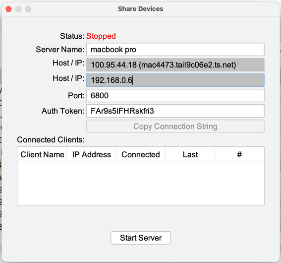
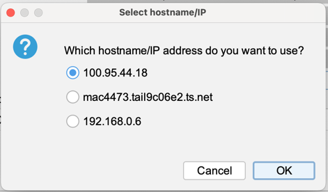
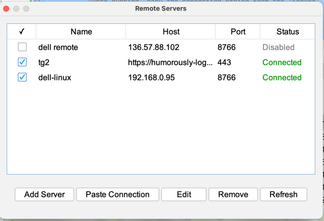
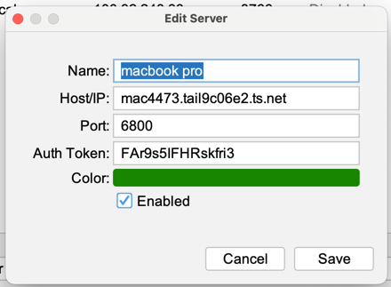

# Running a server and connect to it from a client

Android Device Manager can manage devices connected to another computer running device manager. 
Both computers need to be running the latest version of Device Manager. 
See [this](https://github.com/jpage4500/AndroidDeviceManager?tab=readme-ov-file#install-android-device-manager) page for installation instructions.

# Network Setup

If both computers are on different networks, you’ll need some way to make both computers talk to each other across the Internet. 

I’ve tested with free [ngrok](https://ngrok.com/) and [TailScale](https://tailscale.com/) services

# Tailscale
- Install [Tailscale](https://tailscale.com/) on both computers and login with the same account.

# Server Setup
- The server can be started from within the app. Click on the SERVER toolbar button and select "Start Server".

- Click on Start Server button to start the server
- Click Copy Connection String button
  - If you have a Tailscale network running, select the IP address or hostname of the Tailscale network. This is how the client will reach the server.

# Client Setup
- Connect to a server using the Connect toolbar button -> "Connect to Server"

- You can manually connect to a server using the IP/port/auth token. Or, if you were able to use the "Copy Connection
String" button above, hit "Paste Connection" and the details will be filled in automatically.

