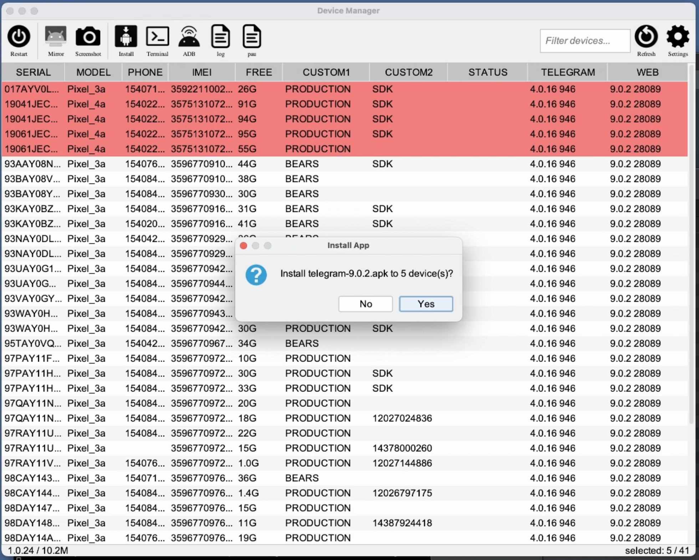
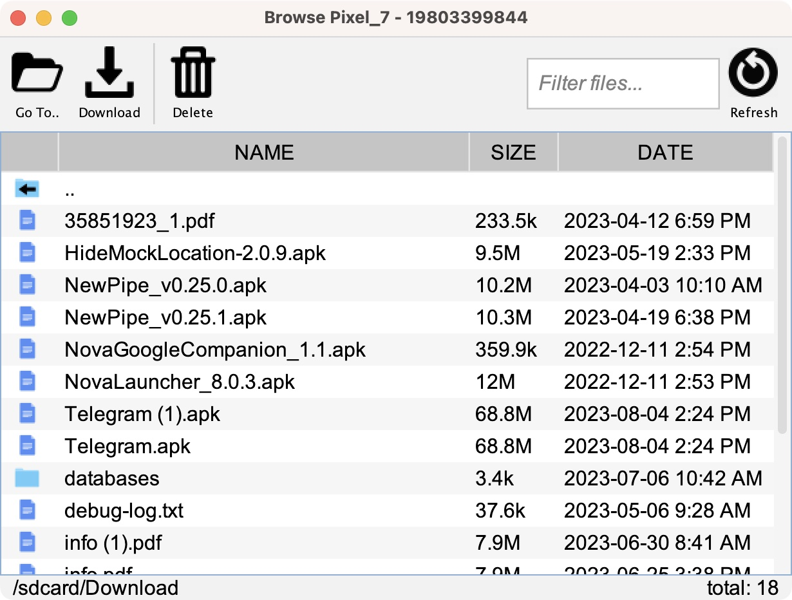

# AndroidDeviceManager

## Description ##
Java desktop app to manage many connected Android devices

## Features ##
- View all connected (and wireless) devices
- Populates device **phone number, free space, IMEI, carrier** (when available)
- **Remote control** selected devices (requires [scrcpy](https://github.com/Genymobile/scrcpy))
- Capture **screenshots** of selected devices
- **Drag and drop an apk** to **install** on selected devices
- **Drag and drop a file** to **copy** to selected devices
- File Explorer / Browse filesystem of device
  - download and view folders/files
  - delete folders/files
- **Restart** selected devices
- Run **user-defined adb commands**
- Set and display custom properties on each device (ie: label each device using device properties)
- Start an **adb shell** session with selected devices
- **View version** of user-defined list of apps

## Why? ##

Surprisingly there’s not a lot of existing software that does this. Here’s what I found:

- **AndroidTool** - [https://github.com/mortenjust/androidtool-mac](https://github.com/Genymobile/scrcpy)
  - PROS: Great UI!!
  - CONS: 6+ years old; doesn’t handle many connected devices very well; crashes frequently

## Requirements

- A **Mac** (the app can be modified to run on Windows but right now it relies on several bash/shell scripts)
- **Brew** (homebrew - a package manager for the mac)
  - `/bin/bash -c "$(curl -fsSL https://raw.githubusercontent.com/Homebrew/install/HEAD/install.sh)"`
- A recent Java Runtime Environment (**JRE**)
  - install a JDK version 17
  - `brew install openjdk@17`
  - create a symlink to the JDK in the /Library/Java/JavaVirtualMachines folder, which is necessary for the app to run (NOTE: the exact command to run should be printed out by the brew install command above)
  - `sudo ln -sfn /usr/local/opt/openjdk@17/libexec/openjdk.jdk /Library/Java/JavaVirtualMachines/openjdk-17.jdk`
  - test out the JRE by running this command: `/usr/libexec/java_home`. It should return a result and not 'no java environment found'
- **adb tools** (adb tools for connecting to devices)
  - install using brew
  - `brew cask install android-platform-tools`
  - add 'adb' to PATH environment variable to make sure ADM can locate adb. This usually involves opening up ~/.profile and adding something along the lines of:
  - `export PATH="/opt/homebrew/bin:$PATH"`
- **scrcpy** - mirror a connected Android device ([https://github.com/Genymobile/scrcpy](https://github.com/Genymobile/scrcpy))
  - `brew install scrcpy`

## Installation

- Download the latest release from here: [https://github.com/jpage4500/AndroidDeviceManager/releases](https://github.com/jpage4500/AndroidDeviceManager/releases)
  - The file you want should look like this: `AndroidDeviceManager.app.zip`
  - unzip/double-click on the file to extract `AndroidDeviceManager.app`
- move `AndroidDeviceManager.app` to the `/Applications` folder on your Mac

## Screenshots ##

## Use Cases ##

We want to manage a lot of Android devices and had previously used MDM (mobile device management) software such as **AirDroid** and **ScaleFusion**. These tools aren't free ($$) but more importantly trying to remote control/view an Android device was often a very slow and choppy experience.

So, instead we took a different approach. Instead of running MDM software on every individual Android device, we connected all of the devices to a single macbook laptop using multiple 16-port USB hubs. The Macbook is running [Splashtop](https://www.splashtop.com/) remote control software. I can now remote login and using Android Device Manager control all of the devices with very little to no lag.

---

Tested with 45 Android devices connected to 1 Macbook laptop (using multiple 16-port USB hubs)
