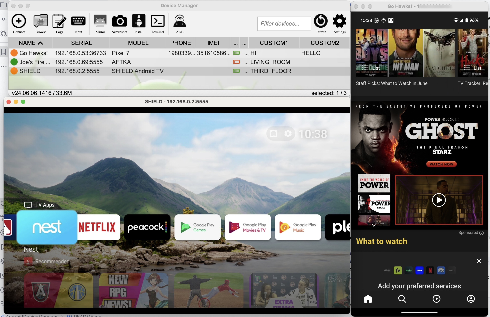
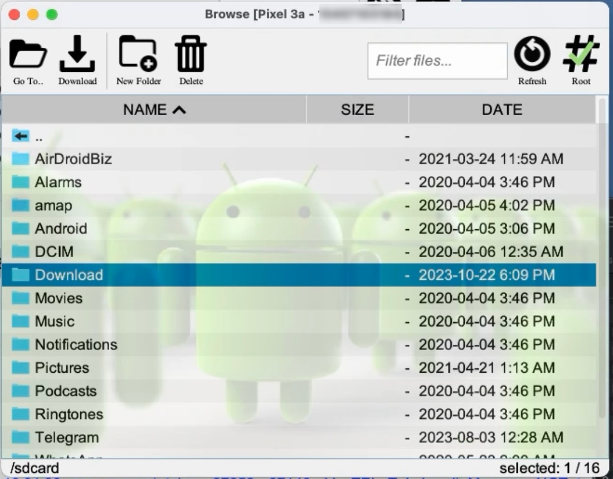
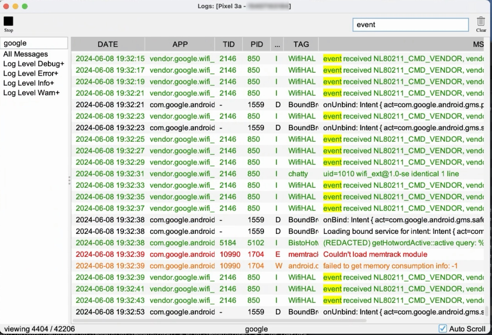

# AndroidDeviceManager

## Description ##
Java desktop app to manage multiple Android devices via adb

## Features ##
- View all connected (and wireless) devices
- Populates device **phone number, free space, IMEI, carrier** (if available)
- **Remote control** selected devices (requires [scrcpy](https://github.com/Genymobile/scrcpy))
- Capture **screenshots** of selected devices
- **Drag and drop an apk** to **install** on selected devices
- **Drag and drop a file** to **copy** to selected devices
- **File Explorer** / Browse filesystem of device
  - download and view folders/files
  - delete folders/files
  - root mode supported
- View **Device Logs**
  - NOTE: this is a work in progress!
- **Restart** selected devices
- Run **user-defined adb commands**
- Set and display custom properties on each device
- Start an **adb shell** session with selected devices
- **View version** of user-defined list of apps

## Screenshots ##

 

 

 

 

## Requirements

- A recent Java Runtime Environment (**JRE**) (17+)
  - NOTE: make sure java is in your system PATH
    - to verify, open a terminal or command window and type `java --version`
- **adb**
  - standalone adb tools can be found [here](https://developer.android.com/tools/releases/platform-tools)
    - Mac OSX can install using brew:
      - `brew cask install android-platform-tools`
- **scrcpy** - mirror a connected Android device ([https://github.com/Genymobile/scrcpy](https://github.com/Genymobile/scrcpy))
  - Mac OSX can install using brew:
    - `brew install scrcpy`

## Run

- Download the latest release from here: [https://github.com/jpage4500/AndroidDeviceManager/releases](https://github.com/jpage4500/AndroidDeviceManager/releases)
  - Mac OSX Users:
    - get the packaged .app version: `AndroidDeviceManager-VERSION-OSX.zip`, extract and move to `/Applications` folder
  - Windows/Linux Users:
    - get the .jar version: `AndroidDeviceManager.jar`
    - run via command-line: `java -jar AndroidDeviceManager.jar`

## Build

NOTE: requires Maven installed and `mvn` available in PATH
  - MacOSX can use brew to install:
    - `brew install maven`
 

- sync this repo
  - `git clone https://github.com/jpage4500/AndroidDeviceManager.git`
- build:
  - `mvn install`
- run:
  - `mvn exec:java`

## Use Cases ##

We want to manage a lot of Android devices and had previously used MDM (mobile device management) software such as **AirDroid** and **ScaleFusion**. These tools aren't free ($$) but more importantly trying to remote control/view an Android device was often a very slow and choppy experience.

So, instead we took a different approach. Instead of running MDM software on every individual Android device, we connected all of the devices to a single macbook laptop using multiple 16-port USB hubs. The Macbook is running [Splashtop](https://www.splashtop.com/) remote control software. I can now remote login and using Android Device Manager control all of the devices with very little to no lag.

---

Tested with 45 Android devices connected to 1 Macbook laptop (using multiple 16-port USB hubs)
