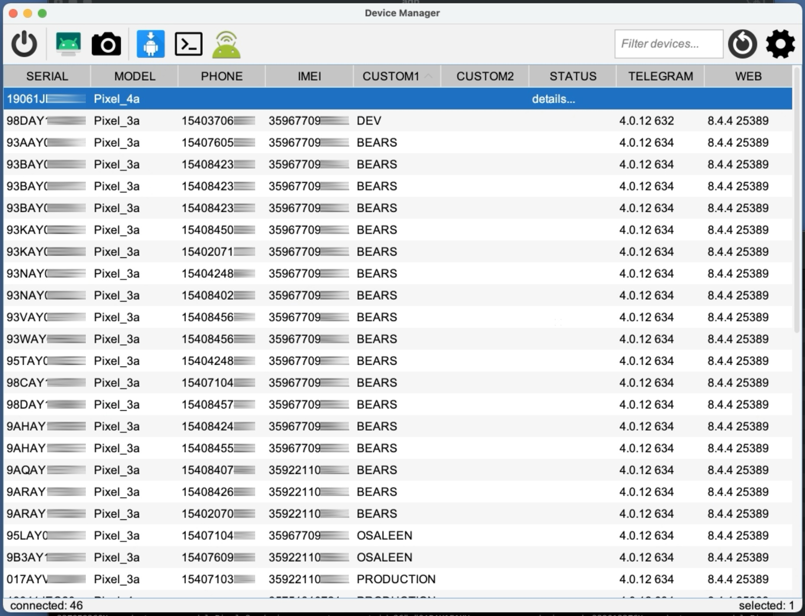

# AndroidDeviceManager

## Description ##
Java desktop app to manage many connected Android devices

## Features ##
- View all connected (and wireless) devices
- Populates device **phone number, IMEI, carrier** (when available)
- **Remote control** selected devices (requires [scrcpy](https://github.com/Genymobile/scrcpy))
- Capture **screenshots** of selected devices
- **Drag and drop a apk** to **install** on selected devices
- **Restart** selected devices
- Run **user-defined adb commands**
- Set and display custom properties on each device (ie: label each device using device properties)
- Start an **adb shell** session with selected devices
- **View version** of user-defined list of apps

## Requirements ##
- adb installed
- [scrcpy](https://github.com/Genymobile/scrcpy) installed (for remote control)
- Mac OS needed but could be modified to support other platforms

## Screenshots ##

---
Tested with 45 Android devices connected to 1 Macbook laptop (using multiple 16-port hubs)
