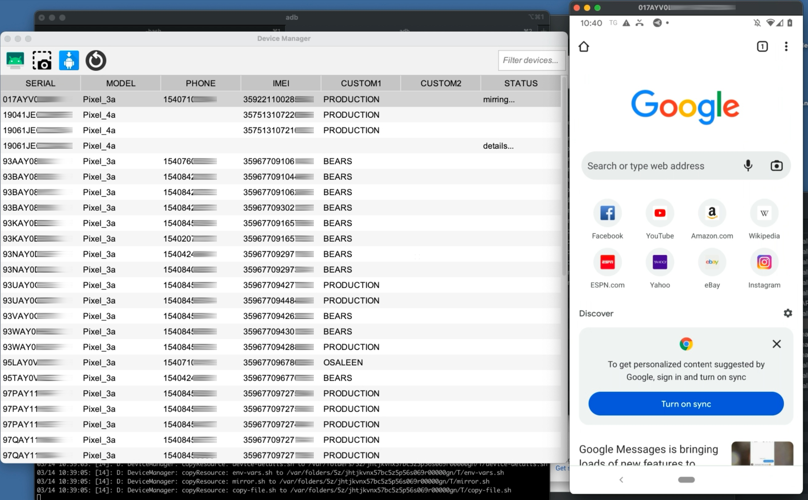
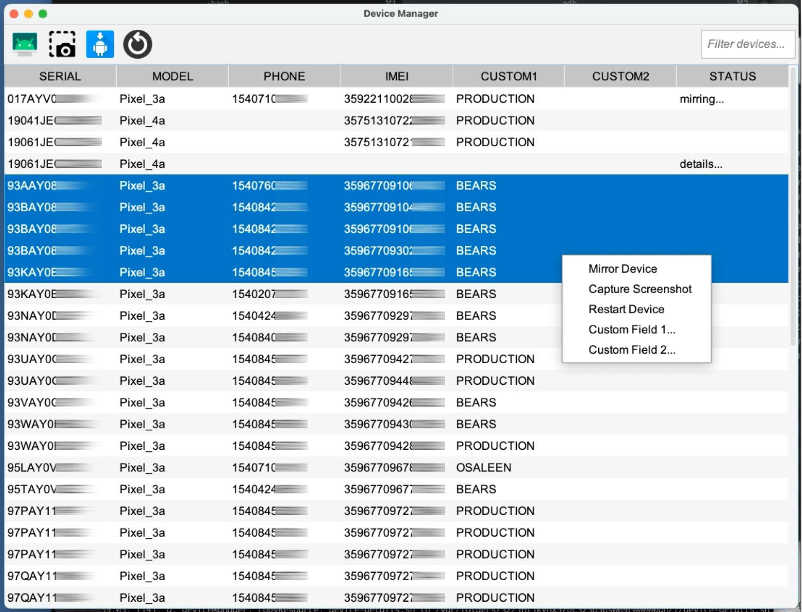
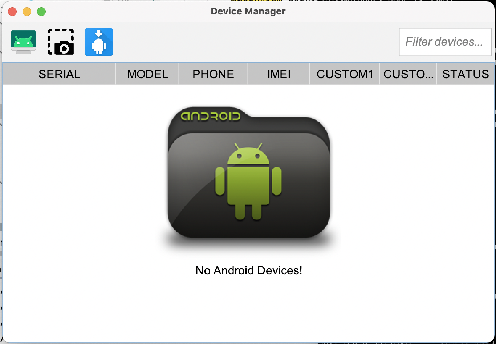

# AndroidDeviceManager

## Description ##
Java desktop app to manage many connected Android devices

## Features ##
- View all connected (and wireless) devices
- Populates device phone number, IMEI, carrier (when available)
- **Remote control** selected devices (requires [scrcpy](https://github.com/Genymobile/scrcpy))
- Capture **screenshots** of selected devices
- **Drag and drop a apk** to **install** on selected devices
- **Restart** selected devices

## Requirements ##
- adb installed
- [scrcpy](https://github.com/Genymobile/scrcpy) installed (for remote control)
 
## Screenshots ##

---
Tested with 46 Android devices connected to 1 Macbook laptop (using multiple 16-port hubs)

## Upcoming Features ##
- status bar (# of devices)
- run user-defined adb commands
