# Android Device Manager

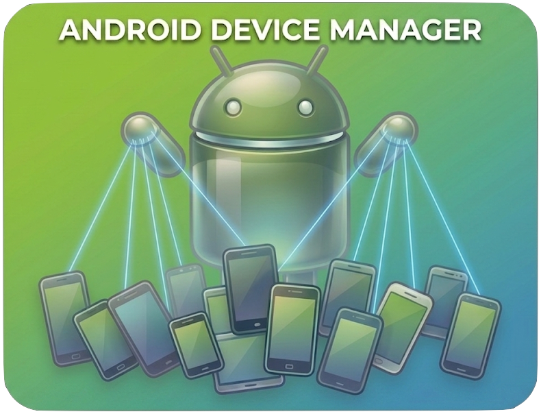

## Description ##

Android Device Manager is a desktop (mac/windows/linux) app which can manage one or more Android devices

---
## Features ##

- View all connected (**usb** and **wireless**) devices
- View devices connected to **another computer** running this app (see [SERVER.md](SERVER.md))
- Populates device **phone number, free space, IMEI, carrier**
- **Remote control** devices ([scrcpy](https://github.com/Genymobile/scrcpy))
- Capture **screenshots** of selected devices
- Record **video** of selected devices
- **Drag and drop an apk** to **install** on selected devices
- **Drag and drop a file** to **copy** to selected devices
- **File Explorer** / Browse filesystem of device
    - download and view folders/files
    - delete folders/files
    - root mode supported
- View **Device Logs**
    - filter by log level/tag
    - add and combine filters to make searching logs easier
- **Restart** selected devices
- Run **user-defined adb commands**
- Run **user-defined scripts**
- Set and display custom properties on each device
- Start an **adb shell** session with selected devices
- **View version** of user-defined list of apps
- Connect to devices wirelessly via **QR code**

---
## Manage devices connected to other computers ##

see [SERVER.md](SERVER.md)

---
## Screenshots ##

### Devices Screen
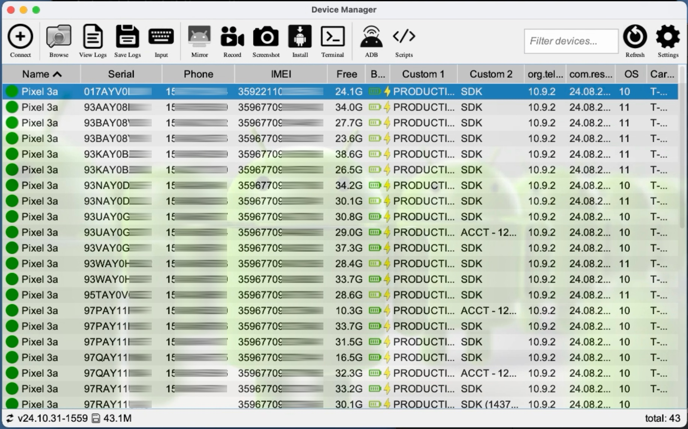

### Log Viewer
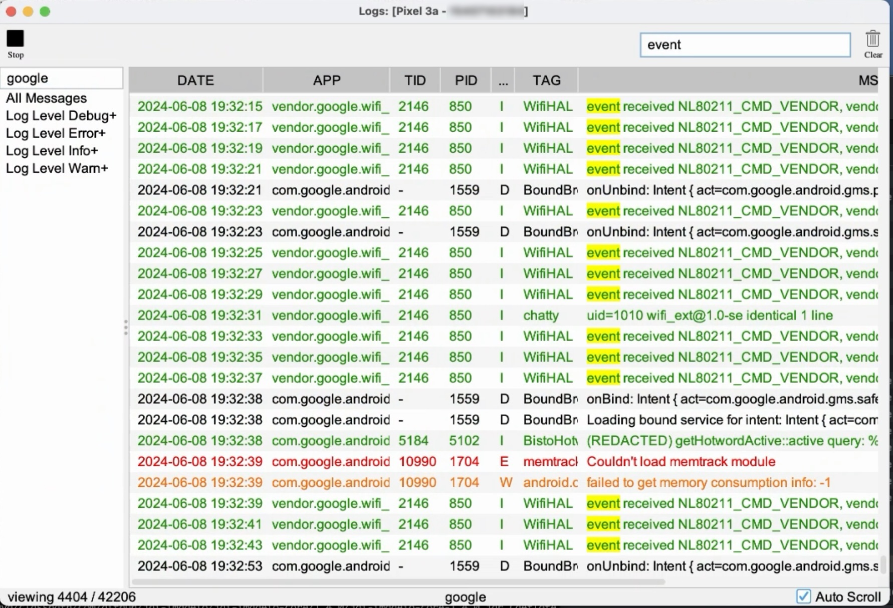

### File Browser
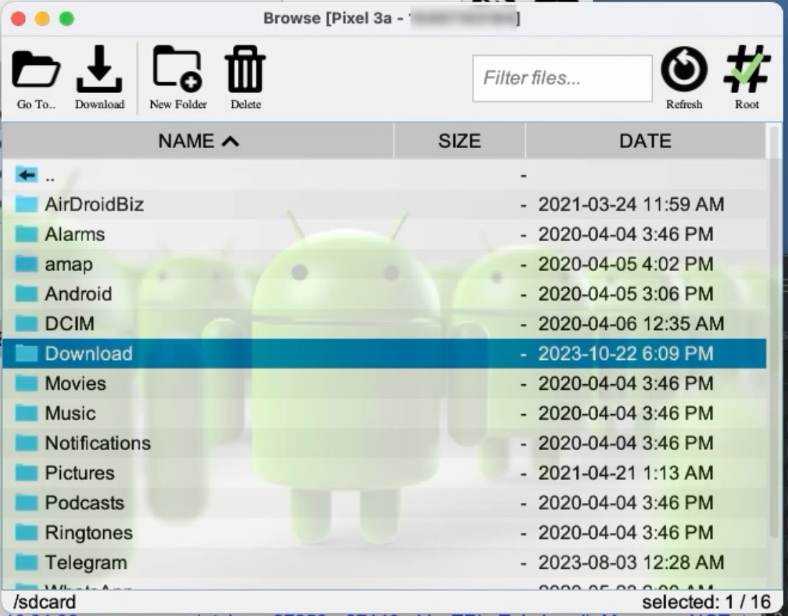

<details>
  <summary>More Screenshots</summary>
<b>Mirror Device (scrcpy)</b></br>
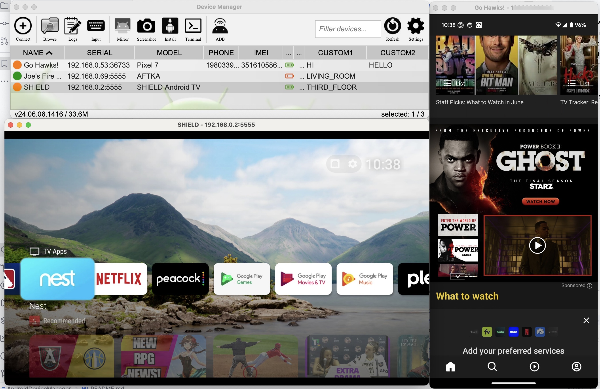
<br>
<b>Device Info</b></br>
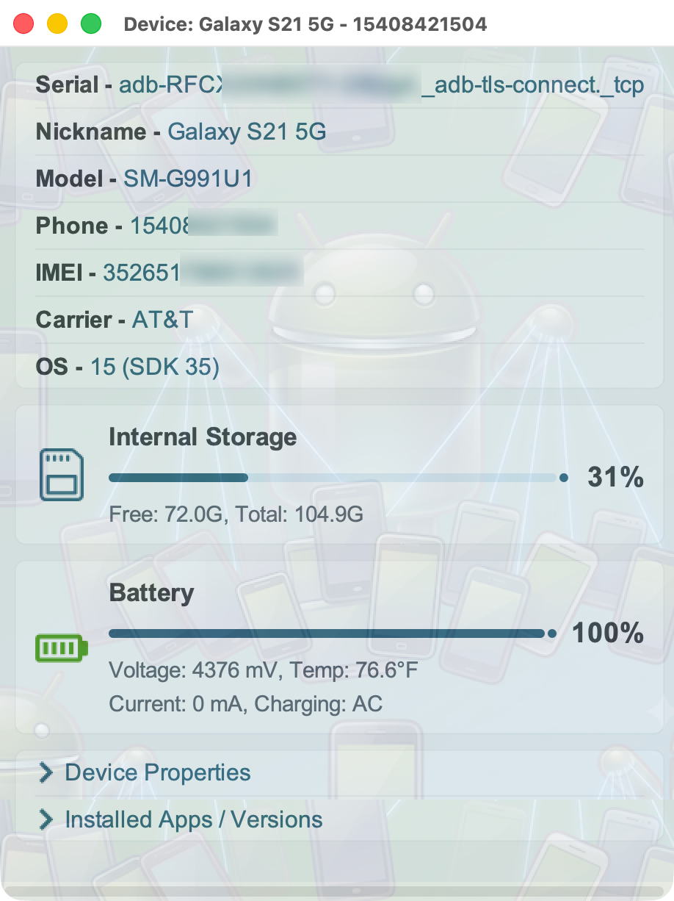
<br>
<b>Battery Details</b></br>
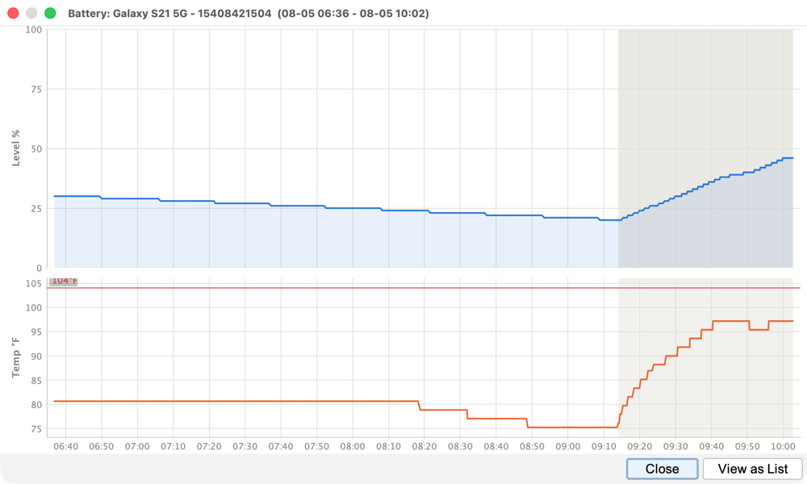
<br>
<b>Connect Device via QR code</b></br>
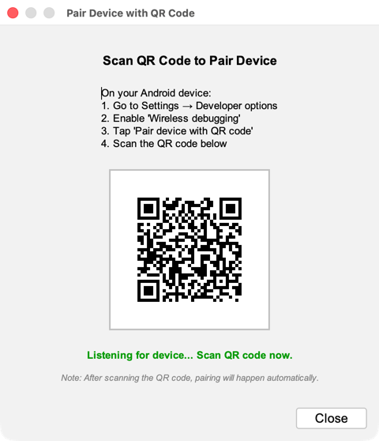
<br>
<b>Device Stats - Battery Temp</b></br>
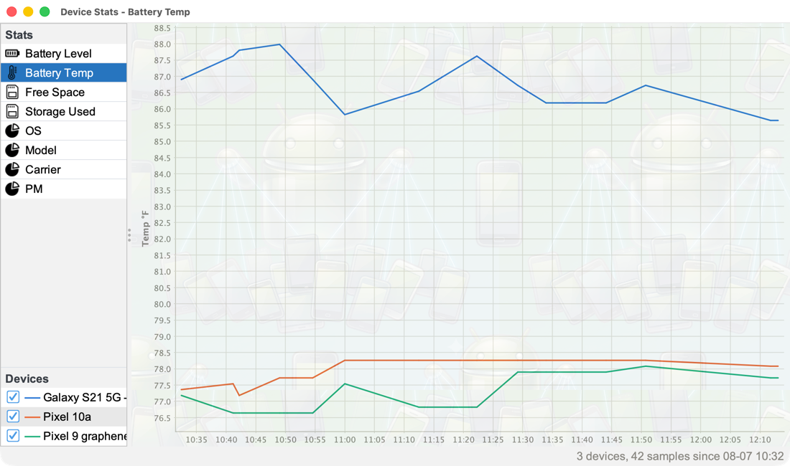
<br>
<b>Device Stats - OS</b></br>
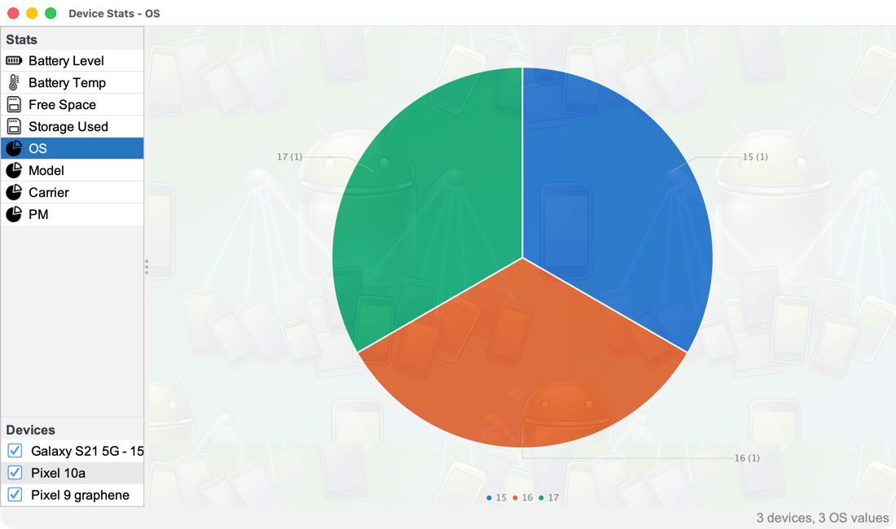
<br>
<b>Save Logs from multiple devices to file(s)</b></br>
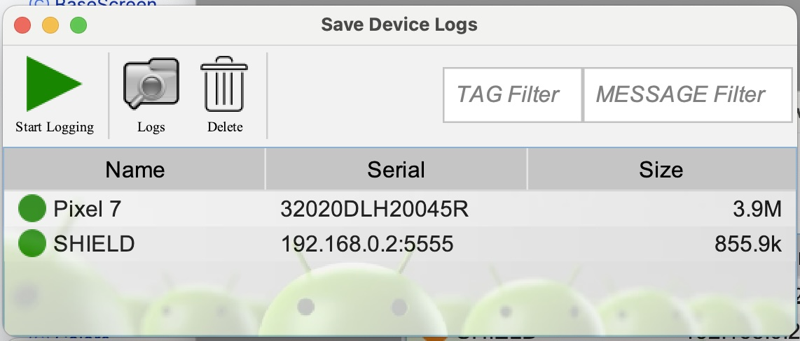
<br>
</details>

---

## Install Android Device Manager

I'm using jdeploy to package this as a native app for Mac/Windows/Linux. This also allows for automatic updates

To install, grab the latest version from [Releases](https://github.com/jpage4500/AndroidDeviceManager/releases)

<details>
  <summary>Installing on a corporate network (TLS inspection / "app.xml could not be found")</summary>

On networks that run TLS inspection (Netskope, Zscaler, Palo Alto, etc) the installer fails with:

```
Cannot load app info because the app.xml file could not be found
```

The real cause is certificates, not a missing file. jdeploy runs the installer on a private JRE it
downloads to `~/.jdeploy`, and that JRE has its own truststore which doesn't include your company's
root CA — so its HTTPS calls fail with a PKIX error. macOS itself trusts the root, which is why
`curl` and your browser work fine.

On macOS, this one command downloads the latest release, installs it, and fixes the certificates:

```
curl -fsSL https://raw.githubusercontent.com/jpage4500/AndroidDeviceManager/develop/scripts/install-corporate.sh | bash
```

It only imports a root CA that macOS already trusts, and does nothing at all if it can't detect any
interception. Once installed, jdeploy auto-updates the app on launch as usual.
</details>

---
## Prerequisites

- **adb** - android debugging tools
- **scrcpy** - used to mirror a device ([link](https://github.com/Genymobile/scrcpy))

<details>
  <summary>Mac Setup</summary>

### Install Homebrew

```
/bin/bash -c "$(curl -fsSL https://raw.githubusercontent.com/Homebrew/install/HEAD/install.sh)"
```

### Install adb

```
brew install --cask android-platform-tools
```

- add adb to PATH

```
echo 'export ANDROID_HOME=$HOME/Library/Android/sdk' >> ~/.profile
echo 'export PATH="/opt/homebrew/bin:$ANDROID_HOME/platform-tools:$PATH"' >> ~/.profile
```

### Install scrcpy

```
brew install scrcpy
```

</details>

<details>
  <summary>Windows Setup</summary>

### Install adb

download from [here](https://developer.android.com/tools/releases/platform-tools) and extract archive

- move extracted platform-tools/ folder to your <HOME DIR>/Program Files/Android/
- add the location to your PATH
- test this by running “adb” in a command window

### Install scrcpy

download and install from [here](https://github.com/Genymobile/scrcpy/blob/master/doc/windows.md)

- make sure “scrcpy” in in PATH

</details>

<details>
  <summary>Linux Setup</summary>

### Install curl, git, adb

```
sudo apt-get install curl git adb
```

### Install Homebrew

```
/bin/bash -c "$(curl -fsSL https://raw.githubusercontent.com/Homebrew/install/HEAD/install.sh)"
```

### Add homebrew to PATH

```
echo >> ~/.bashrc
echo 'eval "$(/home/linuxbrew/.linuxbrew/bin/brew shellenv)"' >> ~/.bashrc
eval "$(/home/linuxbrew/.linuxbrew/bin/brew shellenv)"
```

### Install scrcpy

```
brew install scrcpy
```

</details>

---
## Use Cases ##

We want to manage a lot of Android devices and had previously used MDM (mobile device management) software such as **AirDroid** and **ScaleFusion**. These tools aren't free ($$) but more importantly trying to remote control/view an Android device was often a very slow and choppy experience.

So, instead we took a different approach. Instead of running MDM software on every individual Android device, we connected all of the devices to a single macbook laptop using multiple 16-port USB hubs. The Macbook is running [Splashtop](https://www.splashtop.com/) remote control software. I can now remote login and using Android Device Manager control all of the devices with very little to no lag.

---

Tested with 45 Android devices connected to 1 Macbook laptop (using multiple 16-port USB hubs)
