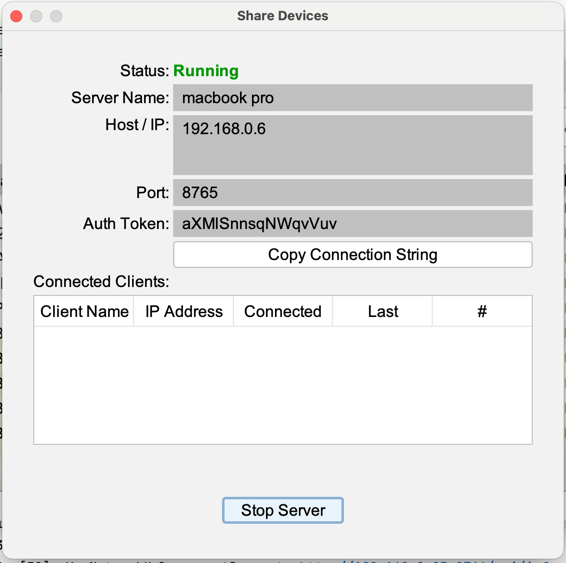
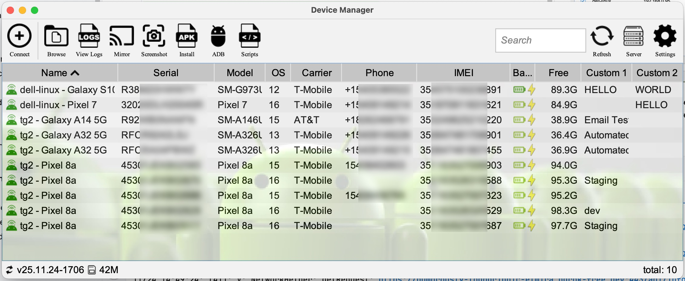

# Android Device Manager Embedded Server

## Overview

The Android Device Manager application includes an server that allows remote clients to view devices connected to the
server and manage them just like they were physically attached. This includes:

- Remote control of devices including sending input (clicks, swipes, text)
- Capture screenshots
- Browse, download and upload files to a device
- Install APKs on a device
- Execute ADB shell commands
- Get and set custom device properties
- Stream real-time device logs
----
## Starting the Server

The server is started from within the app. Click on the SERVER toolbar button and select "Start Server".


You can change the port and auth token before starting the server or just use the defaults.

Once started, the easiest way to connect from another client is to use the "Copy Connection String" button which will
copy the IP/port/auth token to the clipboard.
----
## Running the server in headless mode
The server can also be run in headless mode from the command line.

```
java -jar AndroidDeviceManager.jar --server --port 5555 --auth-token "HELLO WORLD"
```

port and auth token are optional. If not passed, the previously saved values will be used.

If you install Android Device Manager via JDeploy (recommended), here's how to run the server via command line:
```
ADM=$(find "$HOME/.jdeploy" -type f -name "AndroidDeviceManager.jar" -printf "%T@ %p\n" \
    | sort -nr \
    | head -n 1 \
    | awk '{print $2}')

java -jar $ADM --server --port 5555 --auth-token "HELLO WORLD"
```
----

## Connecting to the Server

Connect to a server using the Connect toolbar button -> "Connect to Server"


You can manually connect to a server using the IP/port/auth token. Or, if you were able to use the "Copy Connection
String" button above, hit "Paste Connection".

## Viewing Remote Devices

Once connected, all of the devices will show up like any attached device. 



Most actions such as screenshot, install, remote command, etc can be run on remote devices

## Mirror Remote Device

Instead of running scrcpy which is used locally, remote mirroring a device sends a series of compressed screenshots from the server to the client. 

You can interact with the device by clicking on the screen to send a click. Long-presses and swipes are also supported. Typing on the keyboard will send key events to the remote device as well. 
